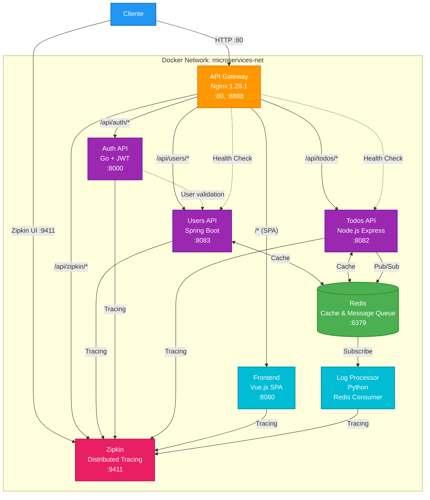
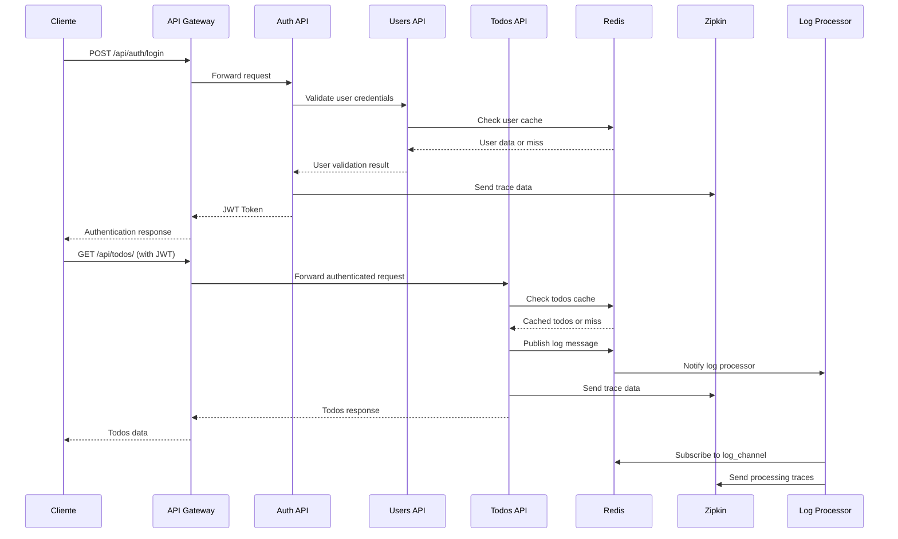

# Microservice Infrastructure

## Estrategia de Infraestructura

Este repositorio implementa una arquitectura de microservicios cloud-native utilizando Docker y Docker Compose como estrategia de Infrastructure as Code (IaC). La solución despliega una aplicación distribuida completa usando imágenes pre-construidas, eliminando la necesidad de código fuente local.

## Arquitectura de la Solución

### Componentes Principales

| Servicio | Imagen Docker | Puerto | Función |
|----------|---------------|--------|---------|
| API Gateway | nginx:1.29.1 | 80, 8888 | Proxy reverso y load balancer |
| Users API | geoffrey0pv/users-api:latest-master | 8083 | Gestión de usuarios con cache Redis |
| Auth API | geoffrey0pv/auth-api:latest-master | 8000 | Autenticación JWT |
| Todos API | geoffrey0pv/todos-api:latest-master | 8082 | CRUD de tareas |
| Frontend | geoffrey0pv/frontend:latest-master | 8080 | Interfaz de usuario Vue.js |
| Log Processor | geoffrey0pv/log-message-processor:latest-master | - | Procesamiento de logs Python |
| Redis | redis:7.0-alpine | 6379 | Base de datos en memoria y cache |
| Zipkin | openzipkin/zipkin:2.23.19 | 9411 | Distributed tracing |

## Diagrama de Arquitectura



### Flujo de Datos Detallado



## Patrones de Diseño Implementados

### 1. API Gateway Pattern
- Nginx actua como punto único de entrada
- Ruteo inteligente basado en paths (/api/users/, /api/todos/, /api/auth/)
- Load balancing automático entre instancias
- Health checks integrados

### 2. Cache-Aside Pattern
- Redis como store de cache distribuido
- Los microservicios implementan lógica de cache transparente
- Mejora significativa en tiempos de respuesta
- Reduce carga en servicios backend

### 3. Service Discovery
- Comunicación inter-servicios via nombres DNS de contenedor
- Red Docker bridge compartida (microservices-net)
- Resolución automática de servicios
- Failover transparente

### 4. Distributed Tracing
- Zipkin para monitoreo de requests distribuidos
- Correlación de traces entre microservicios
- Identificación de cuellos de botella
- Análisis de performance end-to-end

### 5. Horizontal Scaling
- Escalado automático de instancias via Docker Compose
- Load balancing round-robin entre réplicas
- Alta disponibilidad por redundancia
- Capacidad de manejar picos de tráfico

## Estrategia de Despliegue

### Automatización Completa
```bash
./setup.sh          # Configuración inicial automatizada
./deploy.sh          # Despliegue con escalado personalizado
./monitor.sh         # Monitoreo en tiempo real
./cleanup.sh         # Limpieza de infraestructura
./test-patterns.sh   # Validación de patrones implementados
```

### Configuración de Red
- Red bridge dedicada para microservicios
- Aislamiento de tráfico interno
- Comunicación segura entre contenedores
- Exposición controlada de puertos

### Gestión de Estado
- Volúmenes persistentes para Redis
- Configuración externalizada via environment variables
- Secretos gestionados a través de Docker Compose
- Backups automáticos de datos críticos

## Ventajas de esta Estrategia

### Simplicidad Operacional
- Un comando para desplegar toda la infraestructura
- No requiere conocimiento profundo de cada microservicio
- Configuración declarativa via docker-compose.yml
- Scripts automatizados para operaciones comunes

### Portabilidad
- Funciona en cualquier sistema con Docker
- Independiente del sistema operativo host
- Fácil migración entre entornos
- Reproducibilidad garantizada

### Escalabilidad
- Escalado horizontal transparente
- Ajuste dinámico de recursos
- Load balancing automático
- Alta disponibilidad por diseño

### Observabilidad
- Monitoreo integrado de todos los componentes
- Logs centralizados
- Métricas de performance en tiempo real
- Distributed tracing para debugging

## Comandos Básicos

### Despliegue
```bash
# Inicializar infraestructura completa
./setup.sh

# Escalar servicios específicos
./deploy.sh --users-api 3 --todos-api 2 --auth-api 2
```

### Monitoreo
```bash
# Dashboard completo
./monitor.sh

# Logs específicos
docker-compose logs -f users-api
```

### Mantenimiento
```bash
# Reiniciar servicio específico
docker-compose restart users-api

# Cleanup completo
./cleanup.sh --all
```

Esta estrategia de infraestructura proporciona una base sólida para aplicaciones de microservicios modernas, combinando simplicidad operacional con patrones de diseño probados en producción.
